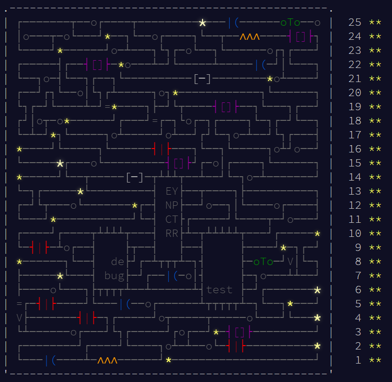

# Advent of Code 2017

For some reason I really enjoy solving the [Advent of Code](https://adventofcode.com) programming challenges.  I think it's because they are well-defined problems that actually have answers. I've noticed that real problems at work (and in life) are too rarely this way.  Anyway, the AoC challenges in 2020 were coming too slow so I went back and did one of the previous calendars.  2017 looked like a good choice.  It had a very pretty calendar animation, and about 10% of the people who started the challenge finished it (as opposed to 2-3% completion rates that we have seen more lately).

Here is the completed advent calendar image:

Isn't that pretty? It's even cooler if you see the animation.

As usual, I solved the problems in Java. Source code is in the "src" directory. The problem descriptions and input files are in the "files" directory. Keep in mind that the goal of these challenges was to solve them fast. That means the code I wrote isn't always following best practices. For example: source files and packages aren't laid out the way I would normally do them (following Maven standards). Every day has a "Main.java" file and rather than create a separate file for each class, I ended up embedding a lot of static classes inside "Main.java". I also don't create a lot of accessors/mutators, instead manipulating object properties directly. All of these would be considered "bad practices", but when you're trying to write code fast, they work.

If you want to try these challenges yourself, head over to:

* https://adventofcode.com/2017

Remember, your input files will likely be different than mine so your answers (and maybe even some of the code) will be different as well.

Watch out for problem 23 part B. That one drove me nuts! Instead of writing a program you have to read what is basically assembly code, try to figure out what it is doing, and then re-write it in an efficient way so it can actually finish before the universe ends. After an hour or two of stepping through code, I finally was able to figure it out. At least... I think I did.  The answer was right...

This is the first year I was able to solve all of the problems without having to look for help on the subreddit boards. Although I almost gave up on 23-B... Overall, this took me about a week.
